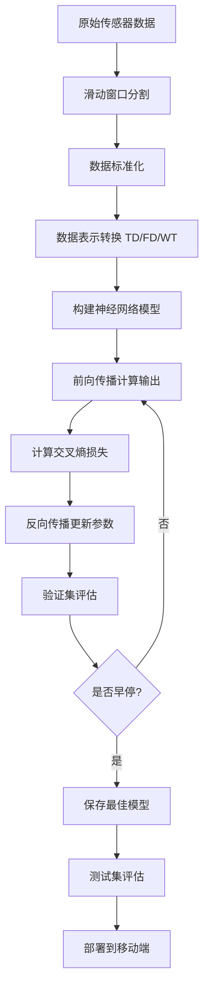

# 手机识别活动指示器（PDAI）

---

## **1. 研究背景与目标**
- **问题**：人类活动识别（HAR）是健康监测、人机交互等领域的关键技术，但现有方法在实时性和准确性上存在挑战。
- **目标**：提出一种新的数据结构和深度学习模型，提升基于智能手机传感器的HAR性能，并实现实时应用。

---

## **2. 核心方法**
### **数据采集与预处理**
- **设备**：iPhone 7（加速度计 + 陀螺仪），固定在腰部。
- **采样频率**：50 Hz，滑动窗口为1.2秒（60个样本），50%重叠。
- **活动类型**：8种（行走、慢跑、上下楼梯等）。
- **数据集**：14,962个样本（79.9%训练，13.4%验证，6.7%测试）。

### **数据表示与结构**
- **三种数据表示**：
  1. **时间域（TD）**：原始传感器数据。
  2. **频域（FD）**：通过FFT转换。
  3. **小波变换（WT）**：多分辨率分析。
- **两种数据结构**：
  1. **单通道（SC）**：传感器数据垂直堆叠（7×60）。
  2. **双通道（DC）**：加速度计和陀螺仪数据分通道堆叠（14×60）。

### **神经网络模型**
- **CNN**：提取时空特征，双通道输入（TD-DC）效果最佳。
- **LSTM**：处理时序依赖，但计算成本较高。
- **ConvLSTM**：结合CNN和LSTM，适合时空数据。

---

## **3. 实验结果**
### **模型性能对比**
| 模型          | 数据表示  | 验证准确率 | 参数量   | 推理时间（单步） |
|---------------|-----------|------------|----------|------------------|
| DC-CNN (TD-DC)| 时间域    | 99.4%      | 621,284  | 184.6 μs         |
| SC-CNN (TD-SC)| 时间域    | 98.89%     | 1,176,972| 240-265 μs       |
| LSTM          | 时间域    | 99.38%     | 193,508  | 2 ms             |

### **公共数据集验证**
| 数据集        | 原方法准确率 | 本文方法准确率 |
|---------------|--------------|----------------|
| WISDM         | 90.04%       | 97.08%         |
| UCI HAR       | 95.18%       | 97.53%         |
| UniMiB SHAR   | 88.51%       | 95.25%         |

---

## **4. 关键思考**
### **为何双通道结构有效？**
- **空间特征分离**：加速度计和陀螺仪数据分通道处理，避免特征混淆。
- **冗余增强**：通过信号重复，防止特征在池化层过早丢失。

### **CNN的优势**
- **局部特征提取**：卷积核捕捉传感器信号的时空相关性。
- **轻量化设计**：双通道结构减少参数量，适合移动端部署。

---

## **5. 限制与挑战**
1. **传感器位置固定**：仅固定在腰部，未测试其他身体部位。
2. **活动类型有限**：仅支持8种日常活动，未涵盖复杂场景。
3. **时间特征不足**：CNN可能忽略长时序依赖，需结合LSTM优化。
4. **多传感器融合**：未集成其他传感器（如磁力计）。

---

## **6. 总结表格**
| 核心贡献                     | 实现方法                           | 优势                          | 限制                          |
|------------------------------|------------------------------------|-------------------------------|-------------------------------|
| 新型数据结构（TD-DC）        | 传感器信号重复+分通道堆叠          | 提升特征提取能力              | 依赖固定传感器位置            |
| 轻量化CNN模型                | 双通道输入+平均池化                | 高准确率+低计算成本           | 对长时序依赖处理不足          |
| 实时移动端部署               | Core ML框架集成                    | 支持iOS设备实时识别            | 仅适配特定硬件（iPhone 7）    |

---

## **8. 未来方向**
- **多传感器融合**：结合环境传感器（如GPS）扩展活动类型。
- **自适应模型**：支持在线学习以适应不同用户行为。
- **轻量化优化**：进一步压缩模型尺寸，适配低功耗设备。

---

## **9. 模型训练步骤详解**

# 模型训练步骤

### **1. 数据预处理流程**
1. **滑动窗口分割**  
   - **输入**：原始时间序列数据（50 Hz采样，总时长约150分钟）。  
   - **操作**：以1.2秒为窗口长度（60个样本），50%重叠切割，生成14,962个数据片段。  
   - **目的**：捕捉周期性活动特征（如步态），同时通过重叠增加样本量。  

2. **数据标准化**  
   ```python
   # 示例代码：数据标准化（Z-Score）
   mean = train_data.mean(axis=0)
   std = train_data.std(axis=0)
   train_data = (train_data - mean) / std
   val_data = (val_data - mean) / std
   ```

3. **数据表示转换**  
   - **时间域（TD）**：直接使用原始数据（6×60 → 重构为7×60单通道或14×60双通道）。  
   - **频域（FD）**：对每个窗口应用FFT，提取幅度谱。  
   - **小波变换（WT）**：3级离散小波分解，生成近似系数和细节系数。  

---

### **2. 模型构建与超参数设置**
#### **CNN架构（以DC-CNN为例）**
```python
model = tf.keras.Sequential([
    # 输入层：双通道（14×60×2）
    layers.Conv2D(20, kernel_size=(2,2), activation='relu', input_shape=(14,60,2)),
    layers.AveragePooling2D(pool_size=(2,4)),  # 输出形状：(7×15×20)
    
    layers.Conv2D(40, kernel_size=(3,3), activation='relu'),
    layers.AveragePooling2D(pool_size=(1,2)),  # 输出形状：(7×7×40)
    
    layers.Flatten(),
    layers.Dense(256, activation='relu'),
    layers.Dense(8, activation='softmax')
])
```

#### **关键超参数**
- **优化器**：Adam（初始学习率 `lr=0.0001`，指数衰减率 `decay_rate=0.9`）。  
- **正则化**：批量归一化（Batch Normalization）加速收敛，缓解梯度消失。  
- **训练配置**：  
  - 批量大小（Batch Size）：50  
  - 训练周期（Epochs）：100  
  - 损失函数：稀疏分类交叉熵（`sparse_categorical_crossentropy`）  

---

### **3. 训练过程**
#### **步骤分解**
1. **前向传播**  
   - 输入数据通过卷积层提取局部特征，池化层降维，全连接层分类。  
   - 输出为8类概率分布（Softmax激活）。  

2. **损失计算**  
   - 计算预测概率与真实标签的交叉熵损失：  
     \[
     \mathcal{L} = -\sum_{i=1}^{8} y_i \log(p_i)
     \]
   - 其中 \(y_i\) 为真实标签的one-hot编码，\(p_i\) 为预测概率。  

3. **反向传播与参数更新**  
   - 通过Adam优化器计算梯度，更新卷积核权重和偏置。  
   - 学习率动态调整：每1000步按 `lr = lr * 0.9` 衰减。  

4. **验证与早停（Early Stopping）**  
   - 每训练完一个epoch，用验证集（2000样本）计算准确率。  
   - 若验证损失连续5个epoch未下降，则提前终止训练。  

---

### **4. 训练监控与调优**
#### **关键指标**
- **训练曲线**：监控训练集和验证集的准确率与损失（见图12）。  
  - **过拟合迹象**：训练准确率远高于验证准确率。  
  - **欠拟合迹象**：两者均低且收敛缓慢。  

#### **调优策略**
- **数据增强**：因传感器位置固定，仅通过滑动窗口重叠增加数据多样性。  
- **学习率调度**：指数衰减平衡收敛速度与稳定性。  
- **模型轻量化**：选择平均池化（非最大池化）减少极端噪声影响。  

---

### **5. 模型评估与部署**
1. **测试集性能**  
   - 使用1000个独立样本计算混淆矩阵（见表3），总体准确率99.4%。  
   - 关键指标：  
     ```python
     from sklearn.metrics import classification_report
     print(classification_report(y_true, y_pred))
     ```

2. **移动端部署**  
   - **模型转换**：通过Core ML Tools将Keras模型转为`.mlmodel`格式。  
   - **实时推理**：iPhone 7上实现50 Hz数据流处理，延迟约80 ms。  

---

## **10. 训练流程图**


---

## **11. 关键问题解答**
### **为什么选择Adam优化器？**
- **自适应学习率**：为不同参数分配独立的学习率，适合非平稳目标函数。  
- **内存效率高**：适合移动端部署场景。  

### **为何不采用数据增强（如旋转、噪声）？**
- **传感器物理约束**：手机固定于腰部，旋转会改变信号物理意义（如水平翻转对应“倒走”）。  
- **实时性要求**：增加预处理步骤会提高计算延迟。  

---

**总结**：通过数据重构、轻量化CNN设计、动态学习率调整和严格验证，模型在保证高精度的同时实现了实时推理，为移动健康监测提供了可靠解决方案。